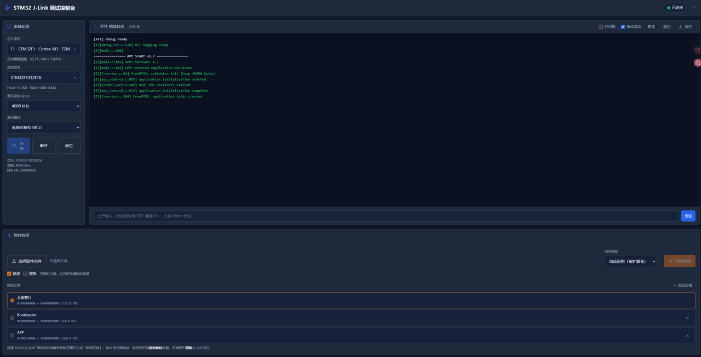
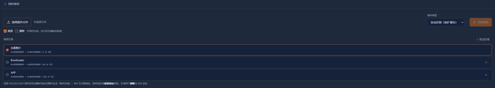

# JLinkHub

**中文** | [English](./README_EN.md)

[](https://www.python.org/downloads/)
[](LICENSE)
[]()

基于 SEGGER J-Link 的 STM32 网页调试工具。在浏览器中选择芯片、查看 RTT 日志、上传固件烧录——无需安装桌面客户端。



## 功能特性

| 功能 | 说明 |
|------|------|
| **芯片选择** | 18 个系列 × 98 个主流型号，级联下拉 + 模糊搜索（输入 `F103`、`C8`、`ZET6` 即可过滤），显示 Flash/RAM 容量 |
| **RTT 日志** | 实时彩色显示，BDSCOL 颜色标签 → 真彩色渲染，INFO/WARNING/ERROR 自动着色；支持时间戳、暂停、清空、保存 |
| **固件烧录** | 浏览器选择本地固件（.elf/.hex/.bin/.axf）上传；支持 **烧录 / 擦除** 独立或组合操作；自定义烧录区域（如 Bootloader / APP 分区）；ELF/HEX 自动解析地址范围；实时进度条，烧录后自动复位 |
| **上行通信** | 向设备 RTT 通道 0 发送指令 |
| **会话隔离** | 日志只推送给发起连接的浏览器，多人可同时使用同一探针 |
| **断线重连** | J-Link 拔插或目标板复位后自动重连 |

## 快速开始

### 前置条件

- Python 3.9+
- [SEGGER J-Link 软件](https://www.segger.com/downloads/jlink/)（含 `libjlinkarm.so`）
- J-Link 探针通过 USB 连接目标板

### 安装与运行

```bash
# 克隆仓库
git clone https://github.com/yourname/jlink-web-console.git
cd jlink-web-console

# 一键搭建（创建虚拟环境 + 安装依赖）
./setup.sh

# 启动
source .venv/bin/activate
python3 web_console.py
```

浏览器打开 **http://127.0.0.1:8080** 即可使用。局域网内其他电脑访问 `http://<服务器IP>:8080`。

> **手动安装**（不用 setup.sh）：`pip install pylink-square flask websockets`

### J-Link 软件安装

```bash
# Ubuntu/Debian (arm64)
wget https://www.segger.com/downloads/jlink/JLink_Linux_V818_arm64.deb
sudo dpkg -i JLink_Linux_V818_arm64.deb

# pylink 会自动在 /opt/SEGGER 下搜索 libjlinkarm.so
# 若安装在别处，启动时指定：JLINK_LIB=/path/to/libjlinkarm.so python3 web_console.py
```

## 使用指南

### 1. 选择芯片并连接

在左侧面板选择芯片系列 → 具体型号，设置通讯速率和复位模式，点击**连接**。

芯片下拉支持模糊搜索：输入 `F1` 过滤所有 F1 系列，输入 `C8` 精确定位 C8T6 型号。

### 2. 查看 RTT 日志

连接后，设备端输出的 RTT 日志会实时显示在中间区域。

**颜色规则**：
- 设备端发送 `BDSCOL(<十进制RGB>)` 标签（如 `BDSCOL(16711680)` = 红色）→ 渲染为该颜色
- 无颜色标签的纯文本行，按行首标签自动着色：

  | 前缀 | 颜色 |
  |------|------|
  | `INFO` / `I` / `[INFO]` / `[I]` | 绿色 |
  | `WARNING` / `W` / `[WARNING]` / `[W]` | 黄色 |
  | `ERROR` / `E` / `[ERROR]` / `[E]` | 红色 |

**设备端发送带颜色日志**（C 代码）：

```c
// 定义颜色宏
#define LOG_RED(fmt, ...)   printf("BDSCOL(16711680)" fmt "\r\n", ##__VA_ARGS__)
#define LOG_GREEN(fmt, ...) printf("BDSCOL(65280)" fmt "\r\n", ##__VA_ARGS__)

// 使用
LOG_RED("Sensor failed!");
LOG_GREEN("Boot OK, version %s", VERSION);
```

### 3. 烧录固件

底部固件烧录面板支持选择文件、配置操作和区域，点击执行后进度条实时显示 Erase → Flash → Verify 各阶段，完成后自动复位 MCU。

**固件类型**：选择固件后按扩展名自动识别（也可手动切换），不同类型的烧录方式有差异：

| 类型 | 烧录方式 |
|------|----------|
| `HEX` / `ELF` / `AXF` | J-Link 按文件内嵌地址直接烧录；选择文件后自动解析地址范围并生成「固件区域」选项（可用于擦除） |
| `BIN` | 无内嵌地址，按所选区域的**起始地址**烧录；固件大小不得超过区域容量 |

**操作选择**：`烧录` / `擦除` 两个复选框可单独或同时勾选。同时勾选时**先擦除后烧录**，保证干净的起始状态。

**烧录区域**：默认内置「全量整片」（起始 `0x08000000`，结束地址随所选型号 Flash 容量自动更新，如 F103ZET6 → 512KB）。点击 **＋ 添加区域** 可自定义分区，例如 OTA 升级中的 Bootloader / App 分区：

```
名称: Bootloader    0x08000000 ~ 0x0800FFFF   (64 KB)
名称: App           0x08010000 ~ 0x0807FFFF   (448 KB)
```

「全量整片」擦除走 J-Link 原生整片擦除（Mass Erase，速度快）；自定义区域擦除经 flash loader 填充 `0xFF` 等效擦除。自定义区域保存在浏览器 localStorage，跨会话保留。



### 4. 上行通信

日志框下方的输入框可向设备 RTT 通道 0 发送指令（Enter 发送）。

## 命令行参数

| 参数 | 环境变量 | 默认值 | 说明 |
|------|----------|--------|------|
| `--host` | `WEB_HOST` | `0.0.0.0` | 监听地址 |
| `--port` | `WEB_PORT` | `8080` | HTTP 端口 |
| `--ws-port` | `WS_PORT` | `8765` | WebSocket 端口 |
| | `JLINK_LIB` | 空 | 指定 `libjlinkarm.so` 路径 |

## 项目结构

```
├── setup.sh              # 环境搭建脚本
├── web_console.py        # 后端：Flask + WebSocket + J-Link 管理
├── web/                  # 前端（纯 HTML/CSS/JS，无外部 CDN）
│   ├── index.html
│   ├── style.css
│   ├── app.js
│   └── stm32_models.json # 内置 18 系列 98 型号数据
└── rtt_lib/              # RTT 通信库
    ├── jlink.py          # J-Link RTT 驱动（pylink）
    └── hardware.py       # 设备基类
```

## API 参考

### REST 端点

| 方法 | 路径 | 说明 |
|------|------|------|
| `GET` | `/api/status` | 查询连接状态（芯片型号、Flash/RAM 容量、探针 SN） |
| `POST` | `/api/connect` | 连接目标板，参数：`chip`、`speed`、`reset_mode` |
| `POST` | `/api/disconnect` | 断开连接 |
| `POST` | `/api/reset` | 复位 MCU |
| `POST` | `/api/write` | 写内存，参数：`addr`、`data`（hex 字符串） |
| `POST` | `/api/upload` | 上传固件文件（multipart），返回 `path` |
| `POST` | `/api/flash` | 擦除/烧录，参数：`path`、`file_type`、`erase`、`program`、`region`、`full_chip` |

### WebSocket

连接 `ws://<host>:<ws-port>` 接收实时推送：

| 消息类型 | 说明 |
|----------|------|
| `rtt_log` | RTT 日志行，含 `text`、`color` 字段 |
| `flash` | 烧录进度，含 `stage`、`percent`、`message` |
| `flash_done` | 烧录完成，含 `ok`、`message` |
| `connected` / `disconnected` | 连接状态变更 |

## 常见问题

### `Expected to be given a valid DLL`

pylink 找不到 J-Link 动态库。确认已安装 [SEGGER J-Link 软件](https://www.segger.com/downloads/jlink/)，或用 `JLINK_LIB` 指定路径。

### 连接成功但没有日志

RTT 控制块未被自动搜到。尝试：
1. 确认固件中已启用 SEGGER RTT（`SEGGER_RTT_Init()` 已调用）
2. 查看 map 文件中 `_SEGGER_RTT` 地址，设置环境变量：
   ```bash
   RTT_SEARCH_START=0x20000000 RTT_SEARCH_RANGE=0x64 python3 web_console.py
   ```

### 中文乱码

默认使用 `asc` 格式读取。若设备输出 UTF-8 中文，修改 `web_console.py` 中 `char_format='utf-8'`。

### 多个 J-Link 探针

自动选择第一个可用探针。如需指定，启动时设置 `SERIAL_NO=<序列号>`（序列号可在 SEGGER J-Link Configurator 中查看）。

### macOS / Windows 支持

本项目主要在 Linux 上开发和测试。理论上在 macOS 上也能运行（pylink 支持），Windows 需要额外配置路径。欢迎提交 PR 改进跨平台支持。

## 技术架构

```
浏览器（单页应用）
  │ WebSocket：RTT 日志 / 烧录进度 / 状态推送
  │ REST API：连接 / 断开 / 复位 / 烧录 / 上传
  ▼
web_console.py（Python）
  ├─ Flask：静态页面 + REST API
  ├─ websockets：WebSocket 实时推送
  ├─ JlinkManager：J-Link 连接生命周期管理
  │   └─ dll_lock：序列化所有 J-Link DLL 调用（DLL 非线程安全）
  └─ pylink → libjlinkarm.so
                    │
              J-Link 探针 ──SWD── 目标板
```

> **线程安全**：J-Link DLL（`libjlinkarm.so`）非线程安全，RTT 读取线程与擦除/烧录线程不能并发调用 DLL。本项目通过 `dll_lock` 互斥锁序列化所有 DLL 调用（RTT 读取、连接、擦除、烧录、复位），杜绝 Segmentation fault。

## 贡献

欢迎提交 Issue 和 Pull Request！

1. Fork 本仓库
2. 创建特性分支：`git checkout -b feature/my-feature`
3. 提交更改：`git commit -m 'Add my feature'`
4. 推送分支：`git push origin feature/my-feature`
5. 提交 Pull Request

## 致谢

- [SEGGER J-Link](https://www.segger.com/products/debug-probes/j-link/) — 硬件调试探针与软件工具链
- [pylink-square](https://github.com/square/pylink) — J-Link 的 Python 绑定
- [Flask](https://flask.palletsprojects.com/) — Web 框架
- [websockets](https://websockets.readthedocs.io/) — WebSocket 库

## License

[MIT](LICENSE) © [Your Name]
